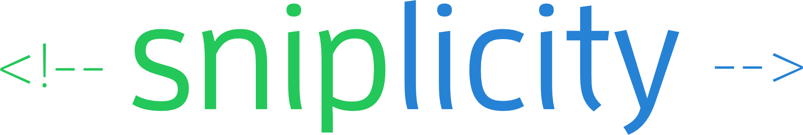

# sniplicity

Simple comment-based static HTML build system that lets you reuse code snippets with simple variables and conditional inclusion. Great for building static websites with less hassle.

- static page builder
- all commands are embedded in HTML comments
- re-use snippets of HTML throughout your project
- use variables to replace values and control your build
- include other files

## Commands

All **sniplicity** commands are embedded in HTML comments, so they will not intefere with your favorite editor. Here are some examples:

```html
<!-- define test -->
<!-- define title Hello World -->

<!-- if test -->
	<h1>--title--</h1>
<!-- endif -->

<!-- cut footer -->
<footer>
	Copyright &copy; 2016
</footer>
<!-- end footer -->

<!-- paste footer -->
<!-- include disclaimer.html -->
```

## Marking snippets with `cut` and `copy`

Snippets work like a text editor clipboard. Use `cut`, `copy` and `paste` to define and use snippets. You may cut or copy them anywhere in your project and they can be pasted anywhere in any file (even the one they were defined in).

```html
<!-- copy nav -->
<p>
	Nav: A, B, C<br>
	(will show up twice because we copied it)
</p>
<!-- end -->

<!-- cut footer -->
<p>
	Copyright &copy; 2016 A, B, C<br>
	(only shows up once because we cut it)
</p>
<!-- end -->
```

Both `cut` and `copy` make snippets. The
difference is `copy` will copy the snippet while, you guessed it, 
`cut` will cut it out of the current file. When in doubt, use `copy`.

## Pasting snippets with `paste`

To use any snippet, just `paste` it by name in any file in your project.

```html
<!-- paste footer -->
<!-- paste nav -->
```

## Assigning variables with `set`

These are more like constants, and you use `set` to define them. Their values are available only inside the file where you `set` them, and the last declaration in a file will have the value used for replacement.

```html
<!-- set test -->
<!-- set message Hello World! -->
```

## Using variables with `--variable_name--` marks

With any variable (or default variable), you may include the value by using a simple mark anywhere in your file with the name of the variable surrounded by two dashes.

```html
<!-- set title Hello World! -->
<title>My title is --title--</title>
```

## Make global default variables with `global`

You may set global default values for variables with `default`. If you use `set` with the same variable name in a given file, the default value will be overwritten inside that file and return to its default value for other files.

```html
<!-- global development -->
<!-- global title My Website -->
```

You may also use these defaults as a form of global variable which you can use anywhere in your project.

## Make conditional builds using `if` and `endif`

You can test a variable to decide if you want to include or exclude
a section. These will work inside snippets as well.

```html
<!-- if test -->
test is truthy!<br>
<!-- endif -->

<!-- if !test -->
test is falsy!<br>
<!-- endif -->
```

## Include other content files using `include`

Right now, **sniplicity** copies the file contents verbatum. Later there may
be filters (eg. markdown, jade).

```html
<!-- include metatags.html -->
```

## License

Copyright (C) 2016 Dave Balmer, Jr. All Rights Reserved.
MIT OSS License
